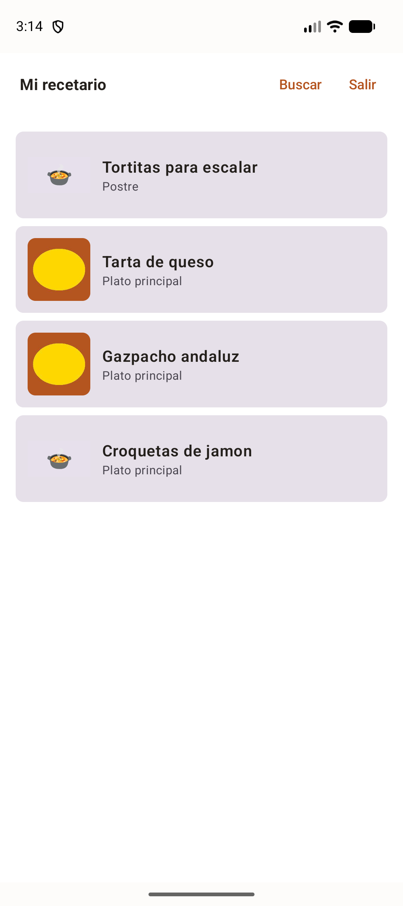
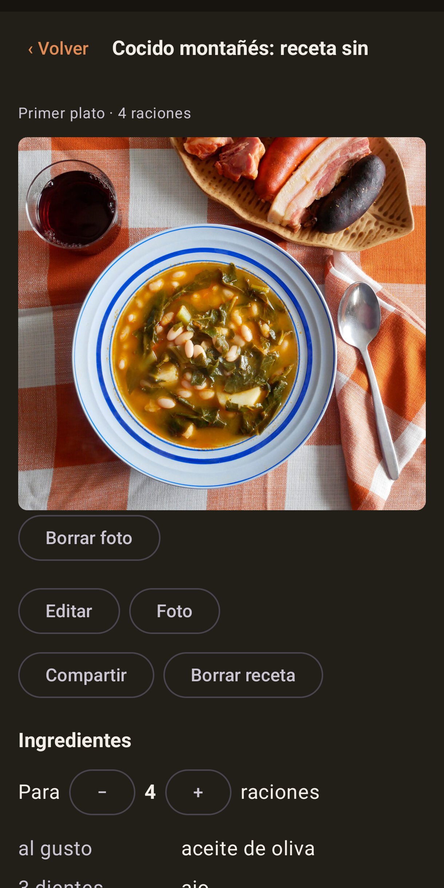
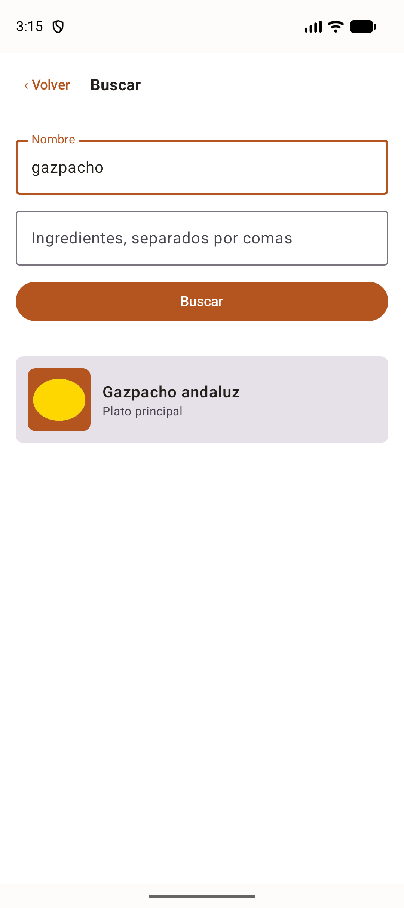
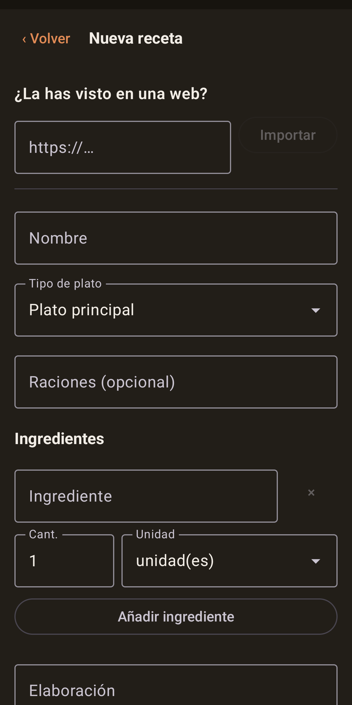

# Recetas

Recetario personal en la nube. Guarda tus recetas, encuéntralas cuando las
necesitas y tenlas a mano mientras cocinas.

**Web:** [recetas.angelgf.com.es](https://recetas.angelgf.com.es) ·
**Android:** [en Google Play](https://play.google.com/store/apps/details?id=com.angelgf.recetas)

<p>
  
  
  
  
</p>

## Qué hace

- **Recetas con fotos**, ingredientes y elaboración. Toda receta nace **privada**.
- **Compartir es un acto deliberado y reversible**: hace la receta visible para
  otras personas registradas, nunca para internet abierto ni para buscadores. Y
  muestra su contenido, nunca el correo de quien la escribió.
- **Búsqueda** por nombre, ingredientes y tipo de plato, combinables. Sirve para
  decidir qué hacer con lo que queda en la nevera.
- **Escalar cantidades** a otro número de comensales. Lo interesante no es
  multiplicar sino **redondear a cantidades medibles**: contables a media unidad,
  gramos y mililitros a entero, el resto a cuartos, y nunca a cero.
- **Importar** pegando la dirección de una página web, leyendo su
  `schema.org/Recipe`. Devuelve un borrador que el usuario revisa; no guarda nada
  por su cuenta.
- **Denunciar** contenido inapropiado, y retirarlo de la parte pública.
- **Borrar la cuenta** entera desde la propia aplicación, sin pedírselo a nadie.

Y lo que deliberadamente **no** hace: no es una red social —sin comentarios,
valoraciones ni seguidores—, ni planificador de menús, ni catálogo curado. No hay
acceso anónimo a nada.

## Cómo está hecho

Todo en C#/.NET 10, salvo la aplicación Android.

| Pieza | Tecnología |
| --- | --- |
| API | ASP.NET Core, arquitectura hexagonal, EF Core, PostgreSQL, JWT |
| Web | Blazor WebAssembly, CSS propio con tokens, sin framework ni biblioteca de componentes |
| Android | Kotlin + Compose, proyecto Gradle aparte |
| Correo | API HTTP de Brevo, tras un puerto del dominio |

Dos reglas atraviesan el diseño:

**Las dependencias apuntan hacia dentro.** `Api` → `Aplicacion` → `Dominio`, y la
infraestructura implementa los puertos del dominio. Si el dominio necesitara un
`using` de EF o de ASP.NET, el diseño estaría mal. Lo vigilan tests de
arquitectura desde la primera feature, con **dos enfoques que se complementan**:
uno inspecciona el ensamblado compilado y otro lee los `.csproj`, porque el
primero no ve un paquete declarado y todavía sin usar.

**La API se diseña como si Android ya existiera.** Ningún endpoint a medida de un
cliente concreto: un solo contrato para todas las superficies. Los DTOs viven en
un proyecto compartido para que no se dupliquen.

## Desarrollo dirigido por especificación

El proyecto sigue un flujo estricto: **primero `spec.md`, luego `plan.md`, luego
`tasks.md`, y solo entonces código**. Cada feature vive en
`spec/features/NNN-nombre/`, y hay dieciséis.

No es burocracia: `spec/constitution/` es la fuente de verdad del producto, y
cuando una idea choca con ella **se replantea la idea, no la constitución**. Eso
descartó, por ejemplo, las valoraciones con estrellas, que contradicen la línea
de que *"público significa consultable, no conversable"*.

Los documentos guardan también **por qué** se decidió cada cosa y qué se
descartó, que es lo que un `git log` no cuenta.

## Ejecutarlo en local

Necesitas .NET 10 y Docker.

```bash
docker compose up -d                    # PostgreSQL, en el puerto 5433 del host
dotnet run --project src/Recetas.Api    # API en http://localhost:5199
dotnet run --project src/Recetas.Web    # web en http://localhost:5200
```

En desarrollo **no se envía correo real**: el enlace de alta se escribe en el
registro de la API con el prefijo `[CORREO SIMULADO]`, y de ahí se saca el token
para completar un alta.

```bash
dotnet test                                    # suite completa
dotnet test --filter "Categoria!=Integracion"  # sin Docker
```

Son 528 pruebas. Las de integración levantan PostgreSQL de verdad con
Testcontainers y escriben archivos en disco: las fotos se prueban con imágenes
reales, no con dobles.

La solución es `Recetas.slnx`, el formato nuevo de .NET 10, no un `.sln`.

La aplicación Android tiene sus propios comandos, en
[`android/README.md`](android/README.md).

## Cómo está organizado

```
src/
  Recetas.Dominio          entidades y reglas; sin dependencias de nada
  Recetas.Aplicacion       casos de uso
  Recetas.Infraestructura  EF Core, disco, Brevo, JWT
  Recetas.Api              endpoints
  Recetas.Contratos        DTOs compartidos entre API y web
  Recetas.Web              cliente Blazor
android/                   aplicación Kotlin, proyecto Gradle aparte
spec/constitution/         misión, stack y roadmap
spec/features/             una carpeta por feature
deploy/                    despliegue y copias de seguridad
tests/                     dominio, aplicación, infraestructura, API y arquitectura
```

## Licencia

Sin licencia explícita: todos los derechos reservados. El código está a la vista
para leerlo, no para reutilizarlo.
